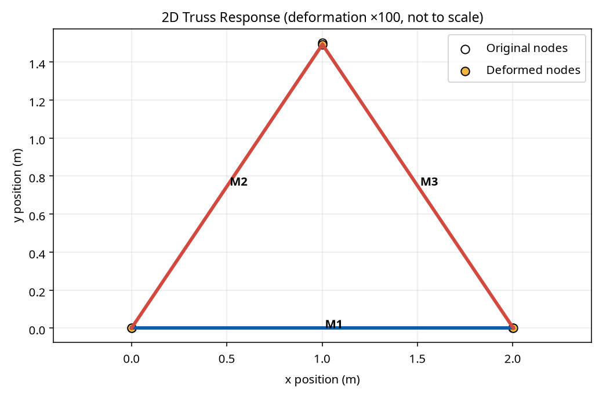
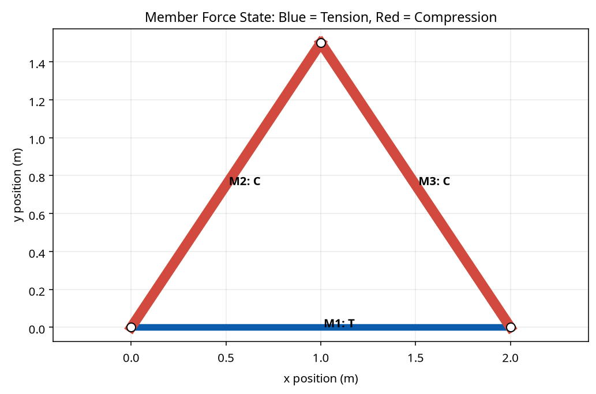
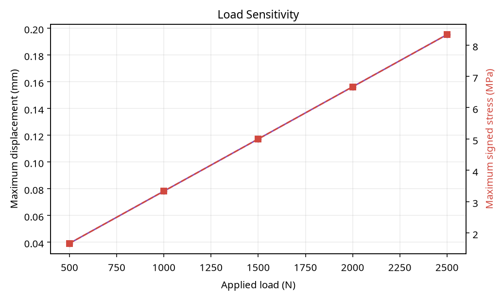
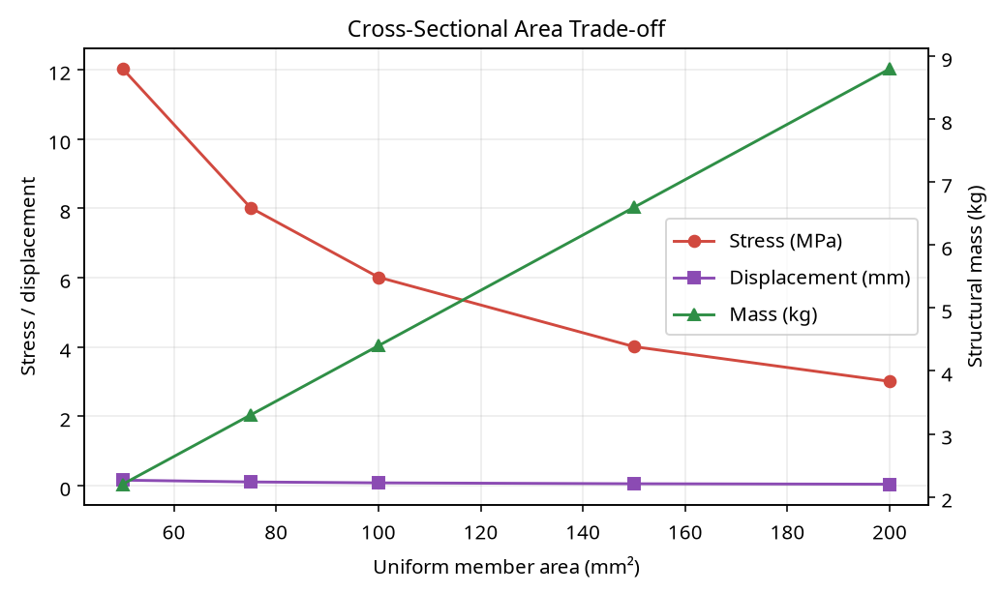
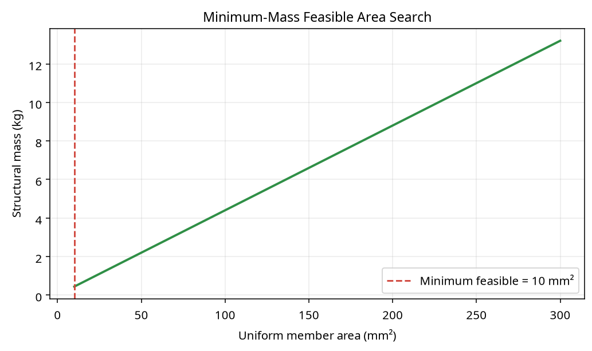

# MATLAB Truss Analysis & Optimization Tool

This project is an independent exploration of computational structural analysis using MATLAB. It analyzes a two-dimensional pin-jointed truss with the direct stiffness method, then evaluates member forces, stresses, factors of safety, deformation, and structural mass.

The project extends my progression from projectile motion and beam mechanics into **statics, matrix structural analysis, and engineering design optimization**.

## Features

- 2D truss node and member definitions
- Pinned and roller support constraints
- Global stiffness-matrix assembly
- Nodal displacement solution
- Support reaction recovery
- Member tension and compression forces
- Axial stress and factor-of-safety evaluation
- Structural mass estimation
- Exaggerated deformed-shape visualization
- Load sensitivity and cross-sectional-area experiments
- Minimum-mass grid search subject to FOS and deflection limits

## Reference truss

The included example is a triangular truss with nodes `(0, 0)`, `(2, 0)`, and `(1, 1.5) m`. Node 1 is pinned, node 2 is a vertical roller, and a downward load is applied at node 3.

| Parameter | Reference value |
|---|---:|
| Young's modulus | 200 GPa |
| Yield strength | 250 MPa |
| Density | 7850 kg/m³ |
| Uniform member area | 100 mm² |
| Downward load | 1000 N |

## Running the MATLAB tool

1. Open MATLAB.
2. Set the current folder to the repository root.
3. Run `src/main.m`.
4. Press **Enter** at prompts to use the reference defaults.
5. Review the printed results, member states, deformed-shape plot, and lightweight design search.

The code uses the direct stiffness equation:

\[
[K]\{u\} = \{F\}
\]

See [`docs/theory.md`](docs/theory.md) for the derivation, sign conventions, and limitations.

## Repository structure

```text
matlab-truss-analysis-optimization/
├── README.md
├── LICENSE
├── src/
│   ├── main.m
│   ├── define_nodes.m
│   ├── define_members.m
│   ├── define_loads.m
│   ├── define_supports.m
│   ├── element_stiffness.m
│   ├── assemble_global_matrix.m
│   ├── solve_displacements.m
│   ├── calculate_member_results.m
│   └── analyze_truss.m
├── optimization/
│   └── optimize_truss.m
├── examples/
│   └── simple_truss.m
├── results/
│   ├── truss_response.png
│   ├── stress_map.png
│   ├── load_sensitivity.png
│   ├── area_tradeoff.png
│   └── optimization.png
├── docs/
│   └── theory.md
└── scripts/
    ├── generate_results.py
    └── test_model.py
```

## Visualization

The gray dashed geometry is the original truss. The colored geometry is the deformed truss with deformation magnified for visibility; it is explicitly **not to scale**. Blue members are in tension and red members are in compression.





## Engineering investigations

### Load sensitivity

The load experiment tests `500`, `1000`, `1500`, `2000`, and `2500 N`. In the linear-elastic model, displacement and stress increase proportionally with load.



### Cross-sectional area

The area experiment tests uniform member areas of `50`, `75`, `100`, `150`, and `200 mm²`. Larger areas reduce stress and deflection while increasing structural mass.



### Lightweight design search

The optimization search tests areas from `10` to `300 mm²` and selects the lightest uniform area satisfying `FOS ≥ 2.0` and maximum displacement `≤ 5 mm` for the reference load case.



## What I learned

This project helped me connect static equilibrium, axial member behavior, matrix assembly, boundary conditions, linear-system solving, stress evaluation, and constrained engineering design. It also made the relationship between material area, structural weight, and performance visible through parameter studies.

## Limitations and future improvements

This is an educational linear-elastic truss solver. It does not include buckling, member bending, joint slip, self-weight, multiple load cases, or 3D geometry. Future improvements could add distributed load conversion, multiple point loads, additional truss topologies, cross-section selection, MATLAB App Designer controls, and comparison with a commercial finite-element tool.

## License

This project is licensed under the MIT License. See [`LICENSE`](LICENSE).

## References

[1]: https://en.wikipedia.org/wiki/Direct_stiffness_method "Direct stiffness method overview"
[2]: https://www.mathworks.com/help/matlab/ "MATLAB Documentation — MathWorks"

## Learning and tutoring acknowledgment

These projects were developed as part of my independent learning journey with tutoring support from **AssignmentDude**. Their guidance helped me understand the engineering concepts, organize the MATLAB implementations, interpret results, and improve my technical documentation. I remain responsible for reviewing the work, understanding the models, and continuing to develop the skills behind each project.
